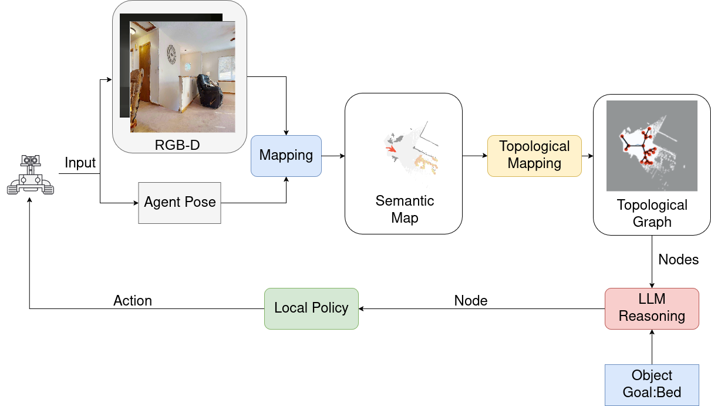

<p align="center">
  <h1 align="center">Zero-Shot Object Goal Navigation via LLM-Driven Semantic Reasoning and STG Exploration</h1>
  
</p>


## Installation

The code has been tested only with Python 3.8 on Ubuntu 20.04.

1. Installing Dependencies
- We use challenge-2022 versions of [habitat-sim](https://github.com/facebookresearch/habitat-sim) and [habitat-lab](https://github.com/facebookresearch/habitat-lab) as specified below:

- Installing habitat-sim:
```
git clone https://github.com/facebookresearch/habitat-sim.git
cd habitat-sim; git checkout tags/challenge-2022; 
pip install -r requirements.txt; 
python setup.py install --headless
python setup.py install # (for Mac OS)
```

- Installing habitat-lab:
```
git clone https://github.com/facebookresearch/habitat-lab.git
cd habitat-lab; git checkout tags/challenge-2022; 
pip install -e .
```

- Install [pytorch](https://pytorch.org/) according to your system configuration. The code is tested on pytorch v2.1.2 and cudatoolkit v11.8. If you are using conda:
```
conda install pytorch==2.1.2 torchvision==0.16.2 torchaudio==2.1.2 pytorch-cuda=11.8 -c pytorch -c nvidia #(Linux with GPU)
conda install pytorch==2.1.2 torchvision==0.16.2 torchaudio==2.1.2 -c pytorch #(Mac OS)
```
- Install [detectron2](https://github.com/facebookresearch/detectron2/) according to your system configuration. 

2. Download HM3D datasets:
#### Habitat Matterport
Download [HM3D](https://aihabitat.org/datasets/hm3d/) dataset using download utility and [instructions](https://github.com/facebookresearch/habitat-sim/blob/089f6a41474f5470ca10222197c23693eef3a001/datasets/HM3D.md). The code requires the datasets in a `data` folder in the following format (same as habitat-lab):
```
data/
  scene_datasets/
  matterport_category_mappings.tsv
  object_norm_inv_perplexity.npy
  versioned_data
  objectgoal_hm3d/
      train/
      val/
      val_mini/
```

3. Download additional datasets
   
Download the [segmentation model](https://drive.google.com/file/d/1U0dS44DIPZ22nTjw0RfO431zV-lMPcvv/view?usp=share_link) in RedNet/model path.


## Setup
Clone the repository and install other requirements:
```
pip install -r requirements.txt
```

[GLIP](https://github.com/microsoft/GLIP) - Follow the installation instructions from the official documentation, make sure to include the GLIP folder inside the root directory, and download the required [config](https://github.com/microsoft/GLIP/blob/main/configs/pretrain/glip_Swin_L.yaml) and [weight](https://huggingface.co/GLIPModel/GLIP/blob/main/glip_large_model.pth) files into the GLIP directory.
```
cd GLIP
python setup.py build develop 
```

Prepare your [OpenAI API Keys](https://platform.openai.com/account/api-keys):

```
export OPENAI_API_KEY=<YOUR KEYS>
```
Open the main.py file and update the code to include your OpenAI API credentials. Replace <YOUR_API_KEY> with your actual values:

```
import openai

# Add your OpenAI API credentials here
client = OpenAI(api_key = "<YOUR_API_KEY>")
```

### Running: 
An example command to run:
```
python main.py --split val --eval 1 --auto_gpu_config 0 \
-n 1 --num_eval_episodes 2000 \
--use_gtsem 0 --num_local_steps 10
```

## Acknowledgements

This repo is heavily based on [L3MVN](https://github.com/ybgdgh/L3MVN). We thank the authors for their great work.
